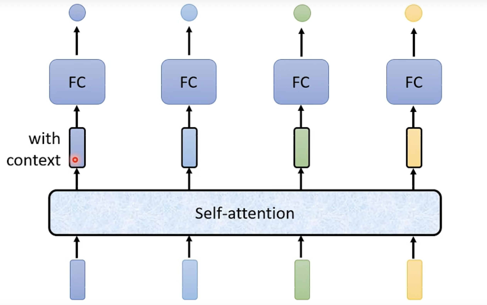

# Self-Attention机制详解

本文档将详细说明Self-Attention机制。

## 1. 引入背景

假设现在要做一个词性识别的任务，

```txt
This is a cat.
```

用FCNet会直接给这四个词定词性，不会考虑四个词之间内部的联系，所以引入Self-Attention，先做Self-Attention，再做FCNet



## 2. Self-Attention计算过程

### 2.1 输入表示

假设我们有一个长度为 $n$ 的输入序列（可以是最开始的输入，也可以是某一FC层的输出），每个位置的向量维度为 $d_{model}$（==也就是对每个词token的嵌入维度==）：
$$
X = [x_1, x_2, \ldots, x_n]^T \in \mathbb{R}^{n \times d_{model}}
$$
每一行都是一个token，其中 $x_i \in \mathbb{R}^{d_{model}}$ 表示序列中第 $i$ 个位置的向量表示。

Self-Attention的核心思想是计算序列中每个位置对其他所有位置的注意力权重，然后基于这些权重对信息进行加权聚合。

### 2.2 线性变换

首先，通过三个不同的权重矩阵将输入 $X$ 分别变换为Query、Key和Value：
$$
Q = XW^Q \in \mathbb{R}^{n \times d_k}\\

K = XW^K \in \mathbb{R}^{n \times d_k}\\

V = XW^V \in \mathbb{R}^{n \times d_v}
$$

### 2.3 注意力分数计算

计算Query和Key之间的相似度分数：
$$
S = QK^T \in \mathbb{R}^{n \times n}
$$
其中 $S_{ij} = q_i \cdot k_j$ 表示第 $i$ 个Query向量与第 $j$ 个Key向量的点积。

### 2.4 缩放

为了避免点积值过大导致softmax函数的梯度消失，需要对分数进行缩放：
$$
S_{scaled} = \frac{QK^T}{\sqrt{d_k}}
$$
缩放因子 $\sqrt{d_k}$ 的作用是控制点积的方差，使其保持稳定。

### 2.5 Softmax归一化

对每一行应用softmax函数，得到注意力权重：
$$
A = \text{softmax}(S_{scaled}) = \text{softmax}\left(\frac{QK^T}{\sqrt{d_k}}\right)
$$
具体地，对于第 $i$ 行：
$$
A_{ij} = \frac{\exp(S_{scaled,ij})}{\sum_{k=1}^{n} \exp(S_{scaled,ik})}
$$
其中 $\sum_{j=1}^{n} A_{ij} = 1$，即每行的权重和为1。

### 2.6 加权聚合

最后，使用注意力权重对Value向量进行加权求和：
$$
\text{Output} = AV \in \mathbb{R}^{n \times d_v}
$$
第 $i$ 个位置的输出为：
$$
\text{output}*i = \sum*{j=1}^{n} A_{ij} v_j
$$

## 3. 完整公式

self-attention的完整公式：
$$
\text{Attention}(Q, K, V) = \text{softmax}\left(\frac{QK^T}{\sqrt{d_k}}\right)V
$$
