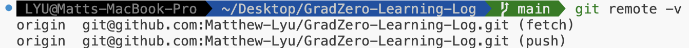

# Git Learning Log

之前学习过一些git的操作，现在除了基本的提交等操作已经忘记的差不多了，创建这个文档开始记录一些更加完整且规范的git操作。

## SSH

生成ssh密钥

```bash
ssh -keygen -t rsa -b 4096 -C "name"
```

## Git

1. 克隆仓库

   ```bash
   git clone 
   ```

   注意的是，如果克隆很大的仓库，那么需要用--depth来限定克隆的提交数

   ```bash
   git clone ****** --depth 10
   ```

2. 创建新分支并切换

   ```bash
   git checkout -b branch_name
   ```

   或者直接在vscode左下角可以创建分支

3. 删除分支

   删除本地分支

   ```bash
   git branch -d branch_name      # 删除已合并的本地分支
   git branch -D branch_name      # 强制删除，即使未合并
   ```

   删除远程分支

   ```bash
   git push origin --delete branch_name
   ```

4. 推送本地分支到远程

   ```
   git push origin branch_name
   ```

5. git commit提交操作

   ```bash
   git add .
   git commit -m "git message"
   git push
   ```

   git commit message的写作规范

   ```
   [type]:描述
   ```

6. 撤回commit操作

   ```bash
   git reset --soft HEAD^
   git push -f # 强制提交
   ```

7. 查看目前的远程分支

   ```bash
   git remote -v
   ```

   

   添加新的远程分支到工作空间

   ```bash
   git remote add branch_name 地址
   git fetch --depth 10
   ```

8. 合并分支

   git merge:

   先切换到要合并的分支，例如branch1合并到main，先切换到main

   ```bash
   git checkout main/master
   git merge other_branch_name
   ```

   报错的话跟随提示继续操作

   git rebase:

   相比于git merge，更线性

   ```bash
   git checkout main
   git pull origin main  # 确保 main 是最新的
   git checkout branch1
   git rebase main
   ```

   git cherry-pick:

   ```bash
   git cherry-pick <commit-hash>
   ```

9. tmux

   ```bash
   tmux; tmux new -s xxx 
   tmux attach -t xx
   tmux ls
   tmux kill-server
   tmux kill-session -t xx
   exit
   ```

10. conda

   ```
   conda create --name myenv
   conda create -n myenv
   conda create -n myenv python=3.9
   conda create -n myenv python=3.9 numpy pandas
   conda env create -f environment.yml
   conda activate myenv
   conda deactivate
   conda env list
   conda info --envs
   conda list # 查看当前环境的包
   conda install package
   conda remove -n myenv --all
   conda create -n newenv --clone myenv # 克隆环境
   conda env export > environment.yml # 导出环境配置
   conda --version
   pip install -r requirements.txt # 下载包
   ```

   
